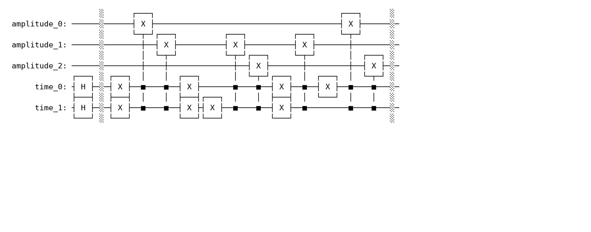

# Quantum Signal Encoding Benchmarks

[](https://github.com/javad-chaharlang/quantum-signal-encoding-benchmarks/actions/workflows/ci.yml)
[](https://www.python.org/)
[](https://www.ibm.com/quantum/qiskit)
[](LICENSE)
[](#reproducibility)

A reproducible research repository for implementing and benchmarking **quantum representations of classical signals** with Qiskit. The project begins with quantum audio and image encoding, then develops toward hybrid quantum-classical medical imaging and secure quantum multimedia processing.

> **Research principle:** an encoding method is not considered complete until its state definition, circuit preparation, decoding procedure, reconstruction accuracy, resource requirements, and noise sensitivity are documented.

## Current release: v0.1.0

The initial release provides a complete educational and testable implementation of a **basis-encoded quantum audio representation**:

```math
|A\rangle =
\frac{1}{\sqrt{N}}
\sum_{t=0}^{N-1}
|a_t\rangle_{\mathrm{amp}}
|t\rangle_{\mathrm{time}}.
```

where each quantized audio amplitude $a_t$ is stored in an amplitude register and each sample index $t$ is stored in a time register.

This implementation is intentionally **not labeled QRDA**. QRDA will be added separately after reproducing its exact state definition and experimental protocol from the primary literature.

### Included

- Validated integer audio quantization input
- Reversible Qiskit state-preparation circuit
- Exact statevector verification
- Shot-based Aer simulation
- Measurement decoding and signal reconstruction
- Circuit resource reporting
- Unit tests and continuous integration
- Executable Python example and Jupyter notebook
- Method documentation and research roadmap

## First reproducible experiment

The first complete experiment encodes and reconstructs the quantized audio signal:

```python
samples = [3, 6, 2, 5]
```

The experiment uses:

| Item | Value |
|---|---:|
| Amplitude qubits | 3 |
| Time qubits | 2 |
| Total qubits | 5 |
| Measurement shots | 4096 |
| Simulator seed | 42 |
| Optimization level | 1 |
| Exact reconstruction | ✅ True |

### Signal reconstruction

The original and reconstructed samples are identical under ideal shot-based simulation.


### Quantum circuit

The preparation circuit places the time register in uniform superposition and writes each quantized amplitude into the amplitude register using controlled operations.



### Measurement distribution

The following figure shows the observed computational-basis states from 4,096 shots.


### Circuit resources

| Metric | Value |
|---|---:|
| Raw circuit depth | 13 |
| Raw circuit size | 17 |
| Transpiled depth | 77 |
| Transpiled size | 118 |

The complete configuration, interpretation, and machine-readable results are available in:

- [`results/audio/basis_encoded_audio/README.md`](results/audio/basis_encoded_audio/README.md)
- [`results/audio/basis_encoded_audio/experiment_report.json`](results/audio/basis_encoded_audio/experiment_report.json)
- [`examples/audio/generate_basis_audio_assets.py`](examples/audio/generate_basis_audio_assets.py)

Reproduce the full experiment with:

```bash
python examples/audio/generate_basis_audio_assets.py
```

> This experiment verifies correctness and reproducibility for a small ideal simulation. It does **not** claim quantum advantage. The next benchmarks will study scaling, finite-shot coverage, transpilation cost, and noise sensitivity.

## Research questions

This repository is designed to answer questions such as:

1. How many qubits and gates are required as signal resolution increases?
2. How accurately can a signal be reconstructed from finite-shot measurements?
3. Which encoding methods remain usable after transpilation and realistic noise?
4. What is the practical cost of state preparation and readout?
5. When does a quantum representation offer a meaningful downstream benefit?

## Repository structure

```text
quantum-signal-encoding-benchmarks/
├── src/qseb/                 # Installable Python package
│   └── audio/                # Quantum audio encodings
├── examples/audio/           # Command-line demonstrations
├── notebooks/audio/          # Reproducible notebooks
├── docs/audio/               # Mathematical and implementation notes
├── tests/audio/              # Unit and reconstruction tests
├── benchmarks/               # Resource, noise, and scalability experiments
├── data/                     # Small public/example inputs only
├── results/                  # Selected reproducible benchmark reports
├── figures/                  # Selected reproducible plots and circuit figures
└── .github/workflows/        # Continuous integration
```

## Installation

### 1. Clone the repository

```bash
git clone https://github.com/javad-chaharlang/quantum-signal-encoding-benchmarks.git
cd quantum-signal-encoding-benchmarks
```

### 2. Create an isolated environment

```bash
python -m venv .venv
```

Activate it on Linux or macOS:

```bash
source .venv/bin/activate
```

Activate it on Windows PowerShell:

```powershell
.venv\Scripts\Activate.ps1
```

### 3. Install the project

```bash
python -m pip install --upgrade pip
pip install -e ".[dev,notebook]"
```

## Quick start

Run the compact command-line demonstration:

```bash
python examples/audio/basis_encoding_demo.py
```

Run the complete reproducible experiment and regenerate all figures and reports:

```bash
python examples/audio/generate_basis_audio_assets.py
```

Minimal Python usage:

```python
from qseb.audio import (
    build_basis_encoded_audio_circuit,
    reconstruct_from_counts,
    simulate_counts,
)

samples = [3, 6, 2, 5]
circuit, spec = build_basis_encoded_audio_circuit(samples, amplitude_bits=3)
counts = simulate_counts(circuit, shots=4096, seed_simulator=42)
reconstructed = reconstruct_from_counts(counts, spec)

print(reconstructed)
```

## Reproducibility

Every benchmark should record:

- Software and Python versions
- Input data and preprocessing
- Random seeds
- Number of shots
- Simulator or backend
- Transpiler optimization level
- Qubit count, circuit depth, and operation counts
- Reconstruction metrics
- Noise-model assumptions
- Hardware limitations and negative results

Generated results should not be committed without the corresponding script, configuration, and seed.

## Roadmap

| Phase | Method or topic | Status |
|---|---|---|
| Audio foundations | Basis-encoded audio implementation | ✅ Implemented |
| Audio foundations | Reproducible visual experiment | ✅ Implemented |
| Benchmarking | Resource scaling | ⏳ Next |
| Benchmarking | Shot sensitivity | ⏳ Planned |
| Benchmarking | Noise sensitivity | ⏳ Planned |
| Audio representations | QRDA | ⏳ Planned |
| Audio representations | FRQA | ⏳ Planned |
| Audio representations | QPAM / SQPAM | ⏳ Planned |
| Image representations | FRQI | ⏳ Planned |
| Image representations | NEQR | ⏳ Planned |
| Image representations | QPIE / amplitude encoding | ⏳ Planned |
| Applications | Hybrid quantum medical imaging | 🔭 Future phase |
| Applications | Secure quantum multimedia processing | 🔭 Future phase |

See [ROADMAP.md](ROADMAP.md) for the detailed research plan.

## Scientific integrity

- Primary papers are cited for every reproduced method.
- Reimplementations are identified explicitly and do not claim ownership of the original method.
- Code, figures, and text from other projects are not copied without compatible licensing and attribution.
- Simulator results are not presented as hardware results.
- Quantum advantage is not claimed without strong classical baselines and full resource accounting.

## Citation

Citation metadata is provided in [`CITATION.cff`](CITATION.cff). Until an archival release and DOI are available, cite the repository as:

> Javad Chaharlang. *Quantum Signal Encoding Benchmarks: Reproducible Qiskit Implementations for Quantum Audio and Image Representations*. GitHub repository, 2026.

## Contributing

Contributions that improve correctness, testing, documentation, or benchmarking are welcome. Read [CONTRIBUTING.md](CONTRIBUTING.md) before opening a pull request.

## License

Licensed under the [Apache License 2.0](LICENSE).

## Author

**Javad Chaharlang, Ph.D.**  
Research Scientist — Quantum Machine Learning, Quantum Signal Processing, AI, and Secure Multimedia Processing

- GitHub: [javad-chaharlang](https://github.com/javad-chaharlang)
- LinkedIn: [Javad Chaharlang](https://www.linkedin.com/in/javad-chaharlang-ph-d-7b417555/)
