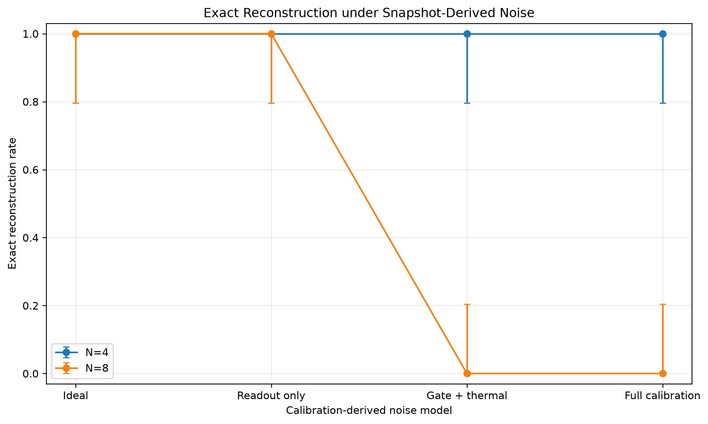
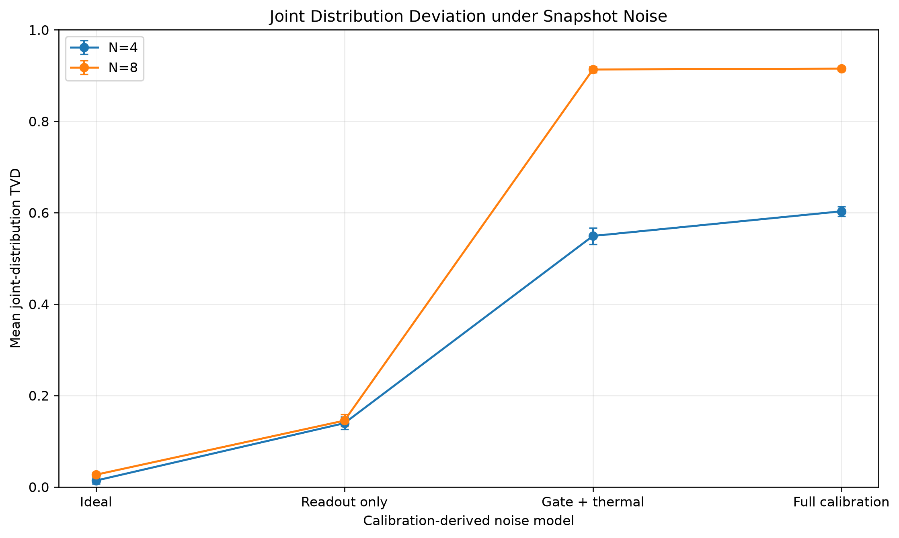

# Calibration-Derived Hardware-Noise Benchmark

## Validated execution

- Backend snapshot: `FakeNairobiV2`
- Raw runs: `120`
- Global conditions: `8`
- Layout-level conditions: `40`
- Calibration records: `54`
- Shots per run: `2048`
- Hardware execution: `False`
- Live calibration: `False`

## Main results

| Samples | Condition | Exact rate | Modal accuracy | Correct-state fraction | Amplitude BER | Joint TVD |
|---:|:---|---:|---:|---:|---:|---:|
| 4 | ideal | 1.000 | 1.000 | 1.000 | 0.0000 | 0.014 |
| 4 | readout_only | 1.000 | 1.000 | 0.861 | 0.0470 | 0.139 |
| 4 | gate_thermal | 1.000 | 1.000 | 0.451 | 0.2255 | 0.549 |
| 4 | full_calibration | 1.000 | 1.000 | 0.397 | 0.2504 | 0.603 |
| 8 | ideal | 1.000 | 1.000 | 1.000 | 0.0000 | 0.027 |
| 8 | readout_only | 1.000 | 1.000 | 0.855 | 0.0461 | 0.145 |
| 8 | gate_thermal | 0.000 | 0.192 | 0.087 | 0.4642 | 0.913 |
| 8 | full_calibration | 0.000 | 0.158 | 0.085 | 0.4697 | 0.915 |

## Central findings

- Gate-plus-thermal noise is the dominant component.
- Readout-only noise preserves exact modal reconstruction for both signal lengths.
- The seven-qubit circuit fails exact reconstruction in all gate-plus-thermal and
  full-calibration runs.
- The six-qubit circuit retains modal reconstruction but suffers substantial
  distribution corruption.
- Layout choice changes the four-sample correct-state fraction by
  `0.024`; the seven-qubit circuit has almost no layout
  freedom because it occupies the full backend.
- Every run reaches complete time-index coverage.

## Figures







## Detailed analysis

See
[`docs/audio/calibration_hardware_noise_analysis.md`](../../../docs/audio/calibration_hardware_noise_analysis.md).

## Machine-readable outputs

- `backend_calibration.csv`
- `hardware_noise_runs.csv`
- `hardware_noise_summary.csv`
- `hardware_noise_layout_summary.csv`
- `hardware_noise.json`

## Reproduce

```bash
python benchmarks/audio/run_basis_calibration_hardware_noise.py
```

## Boundary

This benchmark uses a historical fake-backend snapshot in Aer simulation. It is not
a live backend calibration and not a real hardware execution.
