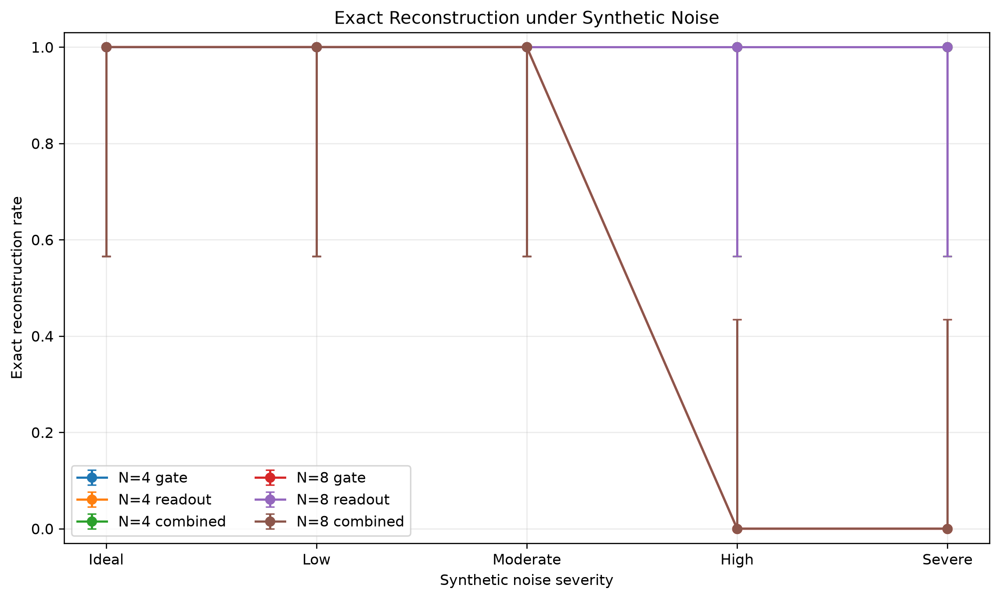
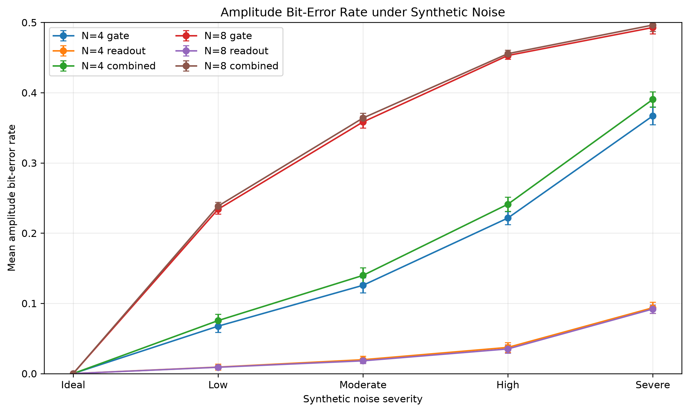
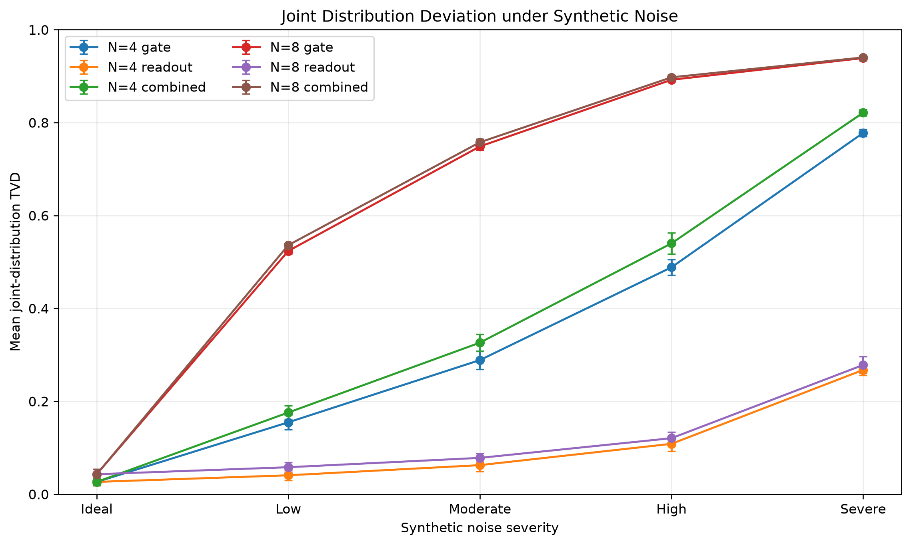

# Basis-Encoded Quantum Audio: Noise-Sensitivity Benchmark

## Controlled configuration

- Raw noisy runs: **130**
- Aggregated conditions: **26**
- Signal lengths: `4`, `8`
- Amplitude width: `4` qubits
- Shots per run: `1024`
- Simulator seeds: `42`, `52`, `62`, `72`, `82`
- Noise families: `gate`, `readout`, `combined`
- Synthetic noise levels: `low`, `moderate`, `high`, `severe`
- Hardware execution: `False`
- Calibration-derived backend model: `False`

## Selected results

| Samples | Family | Severity | Exact rate | Modal accuracy | Correct-state fraction | Amplitude BER | Joint TVD |
|---:|:---|:---|---:|---:|---:|---:|---:|
| 4 | ideal | ideal | 1.000 | 1.000 | 1.000 | 0.0000 | 0.026 |
| 4 | gate | moderate | 1.000 | 1.000 | 0.711 | 0.1257 | 0.289 |
| 4 | readout | moderate | 1.000 | 1.000 | 0.944 | 0.0197 | 0.062 |
| 4 | combined | severe | 1.000 | 1.000 | 0.179 | 0.3904 | 0.821 |
| 8 | ideal | ideal | 1.000 | 1.000 | 1.000 | 0.0000 | 0.043 |
| 8 | gate | moderate | 1.000 | 1.000 | 0.251 | 0.3583 | 0.749 |
| 8 | gate | high | 0.000 | 0.300 | 0.108 | 0.4529 | 0.892 |
| 8 | readout | severe | 1.000 | 1.000 | 0.722 | 0.0919 | 0.278 |
| 8 | combined | severe | 0.000 | 0.025 | 0.060 | 0.4963 | 0.940 |

## Central findings

- Gate noise is substantially more damaging than symmetric readout noise.
- The eight-sample circuit is far more sensitive because its transpiled depth and CX
  count are much larger.
- Eight-sample modal reconstruction collapses between moderate and high gate noise.
- Four-sample modal reconstruction remains exact even under severe distribution
  corruption; exact reconstruction alone is therefore insufficient.
- Time-index coverage remains complete in every run; amplitude corruption is the
  dominant failure mode.

## Figures








## Detailed interpretation

See
[`docs/audio/noise_sensitivity_analysis.md`](../../../docs/audio/noise_sensitivity_analysis.md).

## Machine-readable outputs

- `noise_sensitivity_runs.csv`
- `noise_sensitivity_summary.csv`
- `noise_sensitivity.json`

## Reproduce

```bash
python benchmarks/audio/run_basis_noise_sensitivity.py
```
