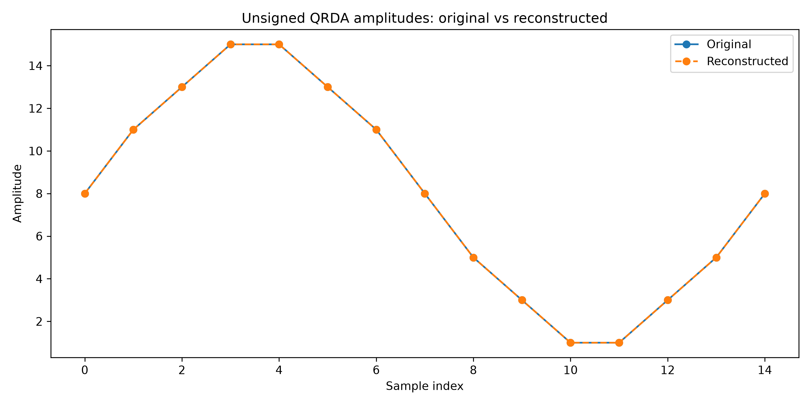

# QRDA primary-paper visual assets

This folder contains the visual outputs generated by
`examples/audio/generate_qrda_primary_paper_assets.py`.

## Summary

- Total qubits: 8
- QRDA box size: 16
- Padding count: 1
- Controlled writes: 33
- Exact unsigned reconstruction: True
- Exact signed reconstruction: True

## Figures

### Logical QRDA circuit

### Transpiled circuit (optimization level 0)

### Transpiled circuit (optimization level 1)

### Signed to unsigned translation

### Exact state support

### Unsigned reconstruction

### Signed reconstruction

### Protocol comparison

## Machine-readable report

- `assets_report.json`
