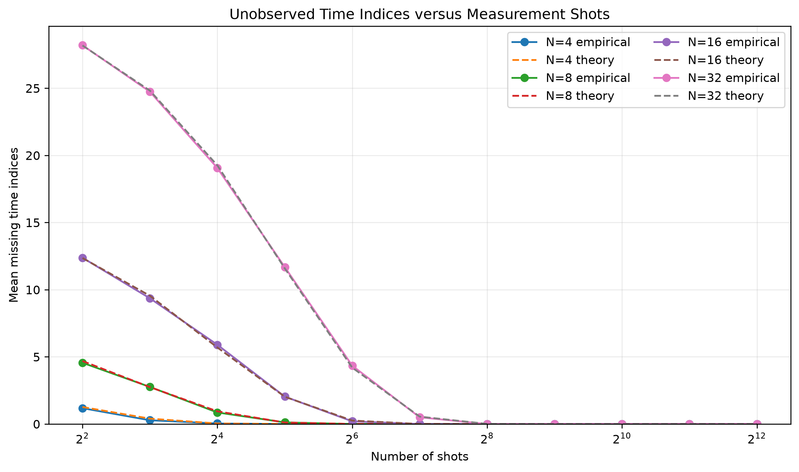
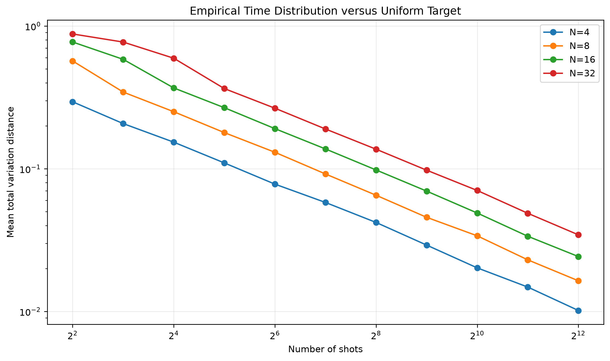

# Basis-Encoded Quantum Audio: Shot-Sensitivity Benchmark

## Scientific question

How many measurement shots are required to observe every time index and reconstruct
the complete basis-encoded signal under ideal noiseless sampling?

## Key property of the present encoding

The time register is uniform, so every one of the `N` time indices has probability
`1/N`. Once a time index is observed, its corresponding basis-encoded amplitude is
deterministic. Under ideal sampling, exact reconstruction is therefore equivalent
to observing all time indices at least once.

## Controlled configuration

- Signal lengths: `[4, 8, 16, 32]`
- Shot counts: `[4, 8, 16, 32, 64, 128, 256, 512, 1024, 2048, 4096]`
- Monte Carlo seeds: `50`
- Fixed amplitude width for Qiskit validation: `4` qubits
- Noise model: `None`
- Hardware execution: `False`
- Theoretical reference: exact uniform coupon-coverage dynamic program

## Theoretical shot thresholds

| Samples | Shots for ≥95% full coverage | Shots for ≥99% full coverage |
|---:|---:|---:|
| 4 | 16 | 21 |
| 8 | 38 | 51 |
| 16 | 90 | 115 |
| 32 | 203 | 255 |

## Selected empirical and theoretical results

| Samples | Shots | Empirical exact rate | Theory | Mean coverage | Mean missing |
|---:|---:|---:|---:|---:|---:|
| 4 | 32 | 1.0000 | 0.9996 | 1.0000 | 0.000 |
| 4 | 64 | 1.0000 | 1.0000 | 1.0000 | 0.000 |
| 4 | 128 | 1.0000 | 1.0000 | 1.0000 | 0.000 |
| 4 | 256 | 1.0000 | 1.0000 | 1.0000 | 0.000 |
| 8 | 32 | 0.8800 | 0.8913 | 0.9850 | 0.120 |
| 8 | 64 | 1.0000 | 0.9984 | 1.0000 | 0.000 |
| 8 | 128 | 1.0000 | 1.0000 | 1.0000 | 0.000 |
| 8 | 256 | 1.0000 | 1.0000 | 1.0000 | 0.000 |
| 16 | 32 | 0.0800 | 0.0734 | 0.8725 | 2.040 |
| 16 | 64 | 0.8200 | 0.7652 | 0.9875 | 0.200 |
| 16 | 128 | 1.0000 | 0.9959 | 1.0000 | 0.000 |
| 16 | 256 | 1.0000 | 1.0000 | 1.0000 | 0.000 |
| 32 | 32 | 0.0000 | 0.0000 | 0.6350 | 11.680 |
| 32 | 64 | 0.0200 | 0.0042 | 0.8644 | 4.340 |
| 32 | 128 | 0.6200 | 0.5629 | 0.9844 | 0.500 |
| 32 | 256 | 1.0000 | 0.9906 | 1.0000 | 0.000 |

## Actual Qiskit encode-measure-decode validation

| Samples | Shots | Coverage | Observed amplitudes correct | Exact reconstruction |
|---:|---:|---:|:---:|:---:|
| 4 | 256 | 1.0000 | True | True |
| 8 | 1024 | 1.0000 | True | True |

## Figures

## Interpretation boundary

This benchmark isolates finite-shot sampling under an ideal noiseless model. It does
not include gate errors, readout errors, backend topology, or hardware drift. Noise
sensitivity is a separate experiment.

Machine-readable outputs:

- `results/audio/shot_sensitivity/shot_sensitivity_runs.csv`
- `results/audio/shot_sensitivity/shot_sensitivity_summary.csv`
- `results/audio/shot_sensitivity/shot_sensitivity.json`
